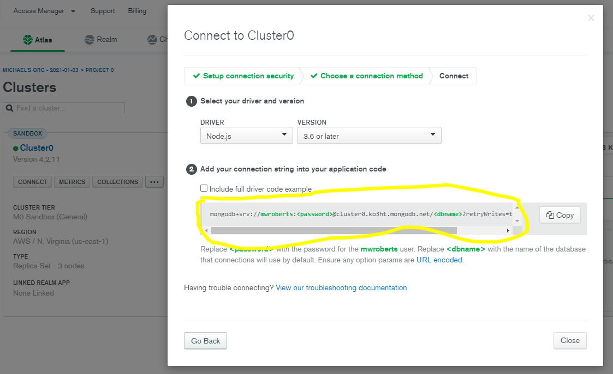

# Projtrack Local

**Current Version:** 1.0.0

**Released:** January 25 2021

**Created By** mwroberts3

## Overview

This is an open source database, feel free to edit it however you would like. At the moment it is only designed to run through localhost and is optimized for a resolution of at 1200px wide, but it is still somewhat responsive with lesser resolutions.

## Usage

**General Usage Notes**

This application is designed to be run in a text editor and used with localhost:4000 in a web browser.

1. Clone the GitHub repo in your terminal
2. Run 'npm install' in your terminal to install all of the necessary libraries
3. The first time you run the app you'll see a prompt asking for your mongodb connect link
   
4. It's recommended that you have mongo Compass installed on your machine in case you need to manipulate the database directly
5. Initiate app in terminal with 'node app.js'
   - **note:** this will also work with nodemon, but there is no advantage to it

## Tips

- If used on an explicitly work computer, might be best to set up a .bat file that automatically runs the script every time the machine is restarted

## Bugs and Issues

- If you leave an unclosed html tag in a text area input the rest of the page when re-rendered will be buggy and may break
- As of version 1.0.0 if the first request is to anywhere but '/', the database will not be accessed. This will be addressed in the first patch

## License and Contributions

- MIT license
- If you have any interest in contributing to the 'official' Projtrack Local please contact me at mwroberts89@gmail.com
